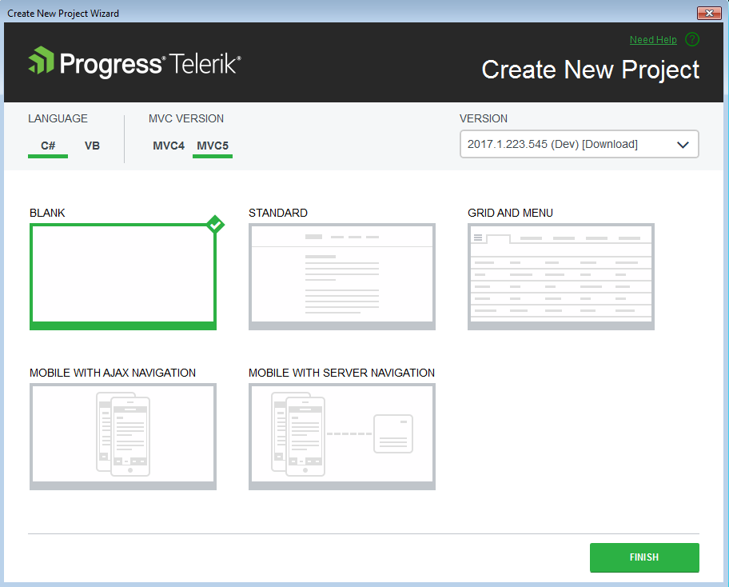

# Creating Projects

This article demonstrates how to create a new Progress&reg; Telerik&reg; UI for ASP.NET MVC application.

## Getting Started

### The Basics

New Progress&reg; Telerik&reg; UI for ASP.NET MVC applications are created by using the **Create New Project Wizard**.

To start the **Create New Project Wizard**, follow either of the approaches below.

**Approach 1**   

1. Go to the Telerik menu.   
2. Click **Telerik** > **Telerik UI for ASP.NET MVC** > **Create New Telerik Project**.

**Approach 2**

1. Click **File** > **New** > **Project**.     
2. Navigate to the Telerik ASP.NET MVC project templates under **Telerik** > **Web**.

For convenience, the same project templates are located under the **Visual C#** > **Web** and **Visual Basic** > **Web** nodes.

The wizard detects all the installed versions of Progress&reg; Telerik&reg; UI for ASP.NET MVC and lists them in the **Version** combobox. This enables you to select a version you want to apply to your project.

**Figure 1. New Project Wizard**

### Project Settings

The **Create New Project** page enables you to modify the project settings by configuring the following options:

* **Project type**&mdash;Choose the desired project type: **Empty**, **Standard**, **Grid**, and **Menu**, **Mobile with Ajax Navigation**, or **Mobile with Server Navigation**.
* **Version**&mdash;Choose the version of Progress&reg; Telerik&reg; UI for ASP.NET MVC you want to use.
* **MVC Version**&mdash;Choose the targeted ASP.NET MVC version.

### New Web Application Creation

After configuring the project settings, click **Finish** to start the creation of the new Kendo UI web application.

As a result, the wizard:  
* Creates a new ASP.NET MVC application.
* Copies all Kendo UI scripts including the `vsdoc` script that enables the Visual Studio IntelliSense feature.
* Copies all Kendo UI content files.
* Copies all Kendo UI editor templates.
* (Optional) Copies the Kendo UI assembly to your solution folder&mdash;it is possible to change this setting in the [Visual Studio Extensions Options]().
* Adds a reference to the `Kendo.Mvc` assembly.

### Custom Modernizr

The Kendo UI ASP.NET MVC application includes a custom stripped-down Modernizr in a file called `kendo.modernizr.custom.js`. It provides an HTML5 element support for old browsers, specifically Internet Explorer.

If you need the Modernizr in your application, remove the existing Modernizr and register another version which includes more components and features. In such cases, if HTML5 element support is required, include the `html5shiv` component to make sure that the newly registered Modernizr [provides such support](http://modernizr.com/docs/#html5inie).

## See Also

* [Create Kendo UI Professional Projects]()
* [Visual Studio Integration Overview]()
* [Configure Projects]()
* [Upgrade Projects]()
* [Convert Projects]()
* [Visual Studio Extensions Options]()
* [Download New Versions]()
